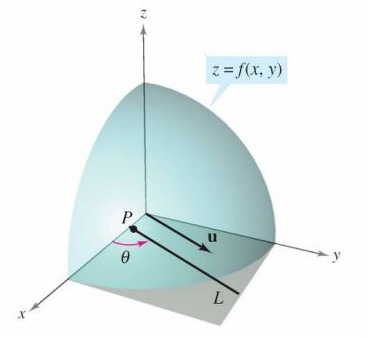

## machine learning 梯度下降法

* * *
#### 批梯度下降法（batch gradient descent）、随机梯度下降法（stochastic gradient descent）
> **date:** January 30, 2018 1:45 PM
> **auther:** xuwang
> **mail:** xuwang.me@gmail.com
> **outline:** 本文主要介绍了机器学习算法中的梯度下降法（批梯度下降法和随机梯度下降法），主要可用于linear regression等方法中的参数确定（通过最小化cost function）；梯度下降法主要包括批梯度下降法和随机梯度下降法等，除此之外还包括小批量梯度下降法（Mini-batch Gradient Descent）等（本文不着重分析介绍）。

### 1. Basics

##### 1. 偏导数

>**偏导数：**多元函数沿坐标轴的变化率
>
>对于二元函数$f(x,y)$来说，$f_x(x,y)$指的是函数在保持$y$方向不变的前提下，函数值沿着$x$轴方向的变化率；$f_y(x,y)$指的是函数在保持$x$方向不变的前提下，函数值沿着$y$轴方向的变化率.

- **几何意义**：偏导数$f_x(x_0,y_0)$就是曲面$f(x,y)$被平面$y=y_0$所截得的曲线在点$(x_0,y_0)$处的切线对于$x$轴的斜率；偏导数$f_y(x_0,y_0)$就是曲面$f(x,y)$被平面$x=x_0$所截得的曲线在点$(x_0,y_0)$处的切线对于$y$轴的斜率。
- **注**：偏导数指的是多元函数沿坐标轴的变化率，并不能表示多元函数沿着任意方向的变化率（即方向导数）。

##### 2. 方向导数

> **方向导数**：多元函数沿着任意方向$u$的变化率，$u$为单位向量。
>
> 对于二元函数$f(x,y)​$来说，我们假设单位向量$u=cos\theta i+sin\theta j​$，其中$\theta​$是向量与$x​$轴正向夹角，单位向量$u​$可以用来表示任意方向导数的方向，如下图。

则$u$方向的方向导数为：

​                                                   $$D_uf={\lim\limits_{t \to 0}\frac{f(x_0+tcos\theta,y_0+tsin\theta)-f(x_0,y_0)}{t}}$$

上面的极限值即为$f​$沿着$u​$方向的方向导数，随着$\theta​$的不同，即可求出任意方向的方向导数。

除此之外，方向导数还可以用偏微分的方法来计算，如下所示：

​                                                $$D_uf(x,y)=f_x(x,y)cos\theta+f_y(x,y)sin\theta$$

##### 3. 梯度

> **定义**：设函数$z=f(x,y)$在平面$D$内具有一阶连续偏导数，则对于每一点$(x,y)\in D$，都可以确定一个向量$(f_x(x,y)，f_y(x,y))$，该向量即为函数$z=f(x,y)$在点$(x,y)$的梯度，记作$grad\ f(x,y)$。

我们如果将梯度向量记为向量$A$，那么我们可以将$D_uf(x,y)=f_x(x,y)cos\theta+f_y(x,y)sin\theta$表示为：

​                                          $D_uf(x,y)=A\cdot u=|A|*|u|*cos\alpha$

其中$\alpha$为方向向量$u$和梯度向量$A$的夹角，当且仅当两个向量平行时，即$cos\alpha$为1时，方向导数的值去最大值，此时方向导数的方向即为梯度的方向，导数的含义是函数单位长度内的增量，那么我们可以知道，在梯度方向上函数增长最快。函数在一点沿梯度方向的变化率（即增长率）最大，最大值为该梯度的模

### 2. 批梯度下降法（batch gradient descent）

梯度下降法主要用于在给定目标条件下求解模型的参数（parameter），如在linear regression中，我们有hypotheses函数 $h$ 如下所示：

​                                                 $h_\theta(X^{(i)})=\theta_0+\theta_1x_1^{(i)}+...\theta_nx_n^{(i)}$

即：

​                                                 $h_\theta(X^{(i)})=\sum\limits_{j=0}^n\theta_jx_j=\theta^TX^{(i)}$

其中，$\theta^T=[\theta_0,\theta_1,...,\theta_n]$，$X^{(i)}=[1,x_1^{(i)},...,x_n^{(i)}]$，$n$为每个样本特征数，一共有$m$个样本，$X^{(I)}$表示第$i$个样本。

我们在确定模型的参数$\theta^T$时，要尽可能的让线性函数$h_\theta(X^{(i)})$拟合出来的值与实际值$y^{(i)}$相近（最好相等）。因此我们定义$cost\ function$：

$J(\theta)=\frac{1}{2}\sum\limits_{i=1}^m(h_\theta(X^{(i)})-y^{(i)})^2$

即，让$J(\theta)$的值尽可能的小，找到让$J(\theta)$值最小的$\theta$的值。

梯度下降法即用来解决此类问题。

我们对$J(\theta)$求关于$\theta_j$的偏导，$j=\{0,...n\}$，得到偏导为$\frac{\partial}{\partial\theta_j}J(\theta)$。

在批梯度下降法中，我们从对$\theta$的值的随机初始化开始，即随机初始化一个$\theta$点：$\theta^T=[\theta_0,\theta_1,...,\theta_n]$，在吴恩达的machine learning中将其称为"initial guess"，然后通过不断重复的更改$\theta$的值使得$J(\theta)$的值越来越小，最终达到最小值。其中，$\theta​$值的改变遵循如下公式：

$\theta_j :=\theta_j-\alpha\frac{\partial}{\partial\theta_j}J(\theta)$

其中，$\alpha$称为$learning\ rate$，$\alpha$的值如果过小，将会导致迭代的次数过多，经过很漫长的时间才能收敛，$\alpha$的值如果过大，将会导致达不到$J(\theta)$的最小值，而是在最小值附近来回震荡。

> **注**：我们注意到，在上面的公式中，各个方向的$\theta_j$是**减去**了其对应方向的偏导数值，合起来即减去了梯度值，由于函数在梯度方向上增长最快，我们便向其反方向不断运动，故为**减号**。

我们对$\frac{\partial}{\partial\theta_j}J(\theta)​$进行进一步的运算求解可以得到如下的式子：

$\frac{\partial}{\partial\theta_j}J(\theta) = \frac{\partial}{\partial\theta_j}\frac{1}{2}\sum\limits_{i=1}^m(h_\theta(X^{(i)})-y^{(i)})^2\\ \quad\quad\quad\ =\sum\limits_{i=1}^m2\cdot\frac{1}{2}(h_\theta(X^{(i)})-y^{(i)})\cdot\frac{\partial}{\partial\theta_j}(h_\theta(X^{(i)})-y^{(i)})\\\quad\quad\quad\ =\sum\limits_{i=1}^m(h_\theta(X^{(i)})-y^{(i)})\cdot\frac{\partial}{\partial\theta_j}(h_\theta(X^{(i)})-y^{(i)})\\\quad\quad\quad\ =\sum\limits_{i=1}^m(h_\theta(X^{(i)})-y^{(i)})\cdot x_j^{(i)}$

上式中$\frac{\partial}{\partial\theta_j}(h_\theta(X^{(i)})-y^{(i)})$对$\theta_j$求偏导的结果是$(h_\theta(X^{(i)})-y^{(i)})$中$\theta_j$的系数$x_j^{(i)}$。

因此，我们将偏导带入$\theta_j$的update公式：

$\theta_j :=\theta_j-\alpha\sum\limits_{i=1}^m(h_\theta(X^{(i)})-y^{(i)})\cdot x_j^{(i)}$

通过利用上面的$\theta_j$的update公式，我们可以最终达到$J(\theta)$的最小值，上述的update rule也被称作$LMS\ update\ rule$，即$lease\ mean\ squares​$（最小均方）。

但是，仔细观察我们便可以发现，每进行一次迭代，我们需要将m个样本的值都带进去进行一次求和（即批梯度下降），我们可以得到批梯度下降的算法如下：

​                                 $Repeat\ until\ convergence\{\\\quad\quad\theta_j:=\theta_j-\alpha\sum\limits_{i=1}^m(h_\theta(X^{(i)})-y^{(i)})\cdot x_j^{(i)}\quad (for\ every\ j)\\\}$

在样本数不多的情况下这种迭代是可以的，但如果在样本数很大，几十万个样本时，我们进行一次迭代都要花很久的时间，更不用说找到最终的$\theta$值了，因此在样本数量很多的情况下，随机梯度下降（stochastic gradient descent）就排上了用场。

### 3. 随机梯度下降法（stochastic gradient descent）

在随机梯度下降法中，我们不用每进行一次$\theta_j​$值的update必须计算所有样本的值，而是每次只选择其中一个样本的值进行计算，随机梯度下降算法如下所示：

​                                 $Repeat\ until\ convergence\{\\\quad\quad for\ i=1\ to\ m,\{\\\quad\quad\theta_j=\theta_j-\alpha(h_\theta(X^{(i)})-y^{(i)})\cdot x_j^{(i)}\quad (for\ every\ j)\\\quad\quad\}\\\}$

在上面的算法中，我们对$\theta_j$的每次update只需要代入一个训练样本即可（批梯度下降法则需要遍历整个样本集进行计算）。

很大一部分情况下，随机梯度下降法得到一个$\theta^T=[\theta_0,...,\theta_n]$（“close” to the minimum）的速度大大快于批梯度下降法。但是随机梯度下降法的缺点是，他永远不会收敛到最小值minimum，得到的$\theta^T=[\theta_0,...,\theta_n]$使得$J(\theta)$的值保持在$J(\theta)$最小值附近不断摆动（但是，在实际情况中，我们得到的参数$\theta$的值是有理由很好的近似认为是真实最小值的$\theta$值，我们可以通过合理的设置$learning\ rate\ \alpha$的值，通过慢慢的减小$\alpha$的值随着算法的运行慢慢减少为0，就优很大的可能保证参数parameters将收敛到全局最小值，而不是在最小值的取值附近摆动）。

因此，当训练样本集合数据量特别大时，随机梯度下降法往往表现的比批梯度下降法更好，在样本量极其大的情况下，可能不用训练完整个样本集就可以获得一个损失值在可接受范围内的模型。

### 4. 小批量梯度下降法（Mini-batch Gradient Descent）

小批量梯度下降法是批量梯度下降法和随机梯度下降法的折衷，也就是对于m个样本，我们采用x个样本来迭代，1<x<m。一般可以取x=10，当然根据样本的数据，可以调整这个x的值。对应的更新公式是：

$\theta_j :=\theta_j-\alpha\sum\limits_{i=t}^{t+x}(h_\theta(X^{(i)})-y^{(i)})\cdot x_j^{(i)}$

每次从样本集中随机抽取一小批进行训练。

